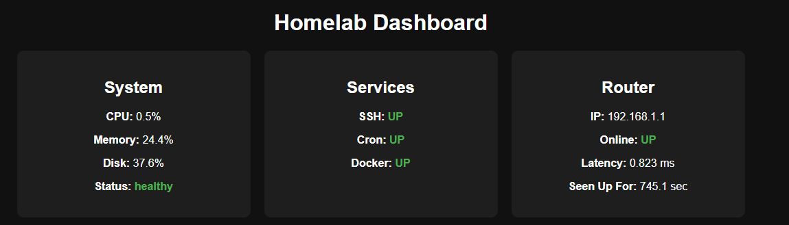

# Homelab Monitoring Dashboard

A lightweight monitoring dashboard built with FastAPI and Python to track system performance and network health.

## Features
- System metrics (CPU, memory, disk usage)
- Linux service monitoring (SSH, cron, Docker)
- Router monitoring (uptime and latency)
- Real-time updating web interface
- Color-coded health indicators

## Tech Stack
- Python
- FastAPI
- psutil
- Linux systemctl
- HTML / JavaScript

## How to Run
1. Clone the repo
2. Create a virtual environment
3. Install dependencies:
   pip install -r requirements.txt
4. Run:
   uvicorn main:app --host 0.0.0.0 --port 8003

## Screenshot

