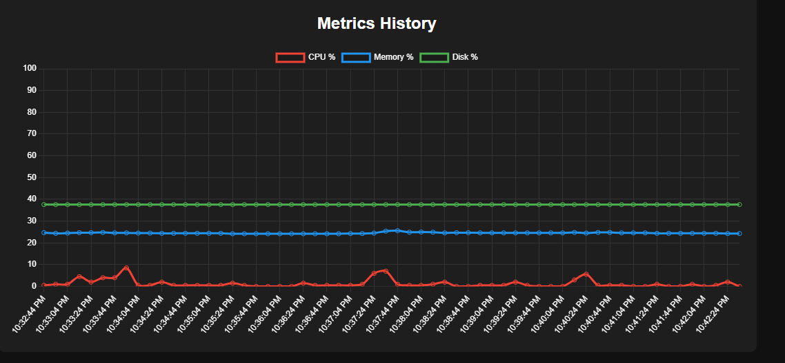
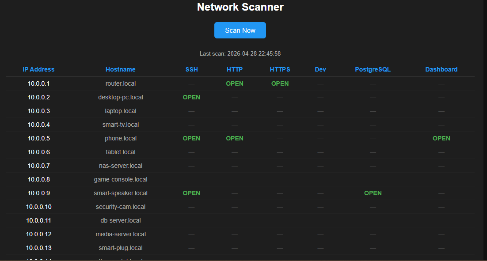

# Homelab Monitoring Dashboard

A lightweight monitoring dashboard built with FastAPI and Python to track system performance and network health. Accessible from anywhere via Tailscale.

## Features
- System metrics (CPU, memory, disk usage)
- Linux service monitoring (SSH, cron, Docker)
- Router monitoring (uptime and latency)
- Local subnet network scanner with port detection
- New device detection and highlighting
- Auto-scan every 15 minutes
- Real-time updating web interface
- Color-coded health indicators
- Deployed in Docker for portability

## Tech Stack
- Python
- FastAPI
- psutil
- Docker
- HTML / JavaScript / Chart.js

## How to Run
1. Clone the repo
2. Run with Docker:
   ```
   docker compose up -d
   ```
3. Open your browser at `http://localhost:8003`

## Screenshots





